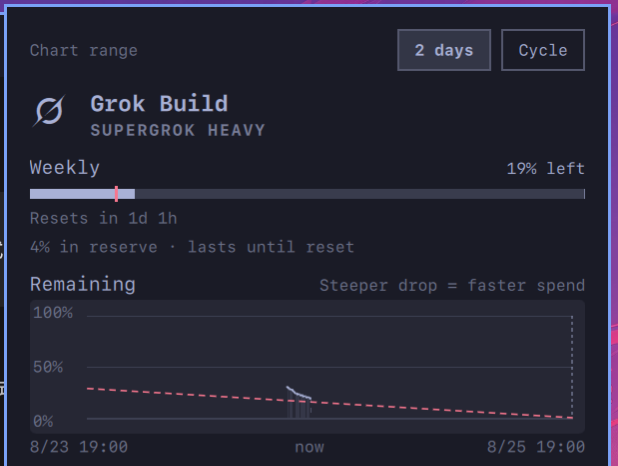
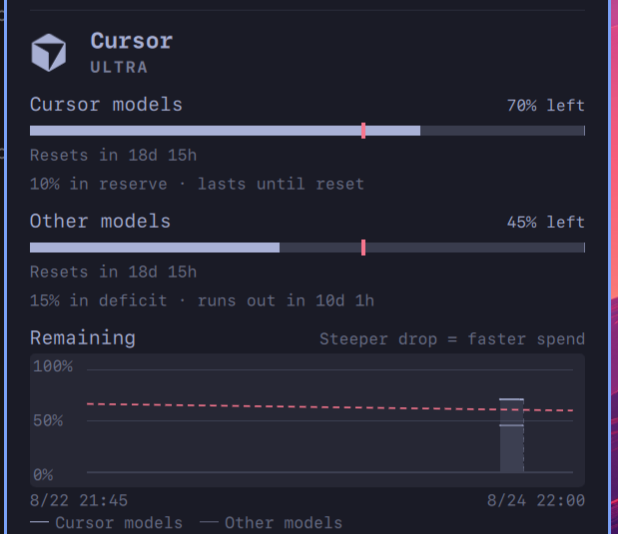
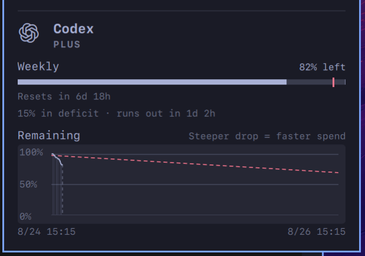

# omarchy-grok-cursor-usage

[Omarchy](https://omarchy.org/) bar widget for leftover AI coding quotas.
One icon, one stacked popup: **Grok**, **Grok Bot**, **Cursor**, and **Codex** (plus any
other collector that drops a usage record).

Stock `omarchy.agents` already covers Claude / Codex / Fireworks as meters
and token tables. This fork adds Grok and Cursor collectors, a patched
Codex collector, leftover-vs-time charts, and CodexBar-style even-burn pace.







## What it does

- **Bar** — Grok mark with a leftover meter on the same pixels as the
  panel-open underline (other styles: vertical meter, percent).
- **Stacked popup** — every ready subscription, no tab switching.
- **Countdown meters** — fill is remaining, not spent. A red tick is
  even-burn remaining (elapsed fraction of the quota window). Caption is
  reserve / deficit / on pace.
- **Remaining over time** — leftover vs time for 7-day (or longer) windows.
  5-hour session pools are ignored. Identical leftover samples collapse to a
  plateau so a 15-minute poll does not pile dots.
  - **2 days** (default): a 2-day span (1.8 days before now, 0.2 after),
    snapped to `:00` / `:15` / `:30` / `:45`. If the current cycle starts
    inside that lookback, the left edge is the quarter-hour at or before the
    first sample and the span stays 2 days. If reset is within 2 days, the
    right edge is the reset and the span stays 2 days. A 7-day cycle cannot
    trip both.
  - **Cycle**: first sample through reset.
  - Data stops at now. A dashed now-marker runs from 0% up to the current
    leftover. A red dashed even-burn line fades toward the future.
- **Plan / auth** — SuperGrok / Grok Bot Plan / Ultra / Plus (whatever the collector
  reports). Sign-in hints when a CLI session is missing.

## Install

Needs Omarchy / Quickshell and Python 3.

- **Grok** — `grok login` (reads `~/.grok/auth.json`, never stored here)
- **Grok Bot** — signed-in Cursor app (`~/.config/Cursor/User/globalStorage`), uses Cursor's weekly Sand pool (separate from SuperGrok)
- **Cursor** — signed-in Cursor app (`~/.config/Cursor/User/globalStorage`)
- **Codex** — `codex login` (app-server RPC; this collector uses
  `-a never` because Codex CLI 0.149 rejected `-a untrusted`)

```bash
git clone https://github.com/songlairui/omarchy-grok-cursor-usage.git
cd omarchy-grok-cursor-usage
./install.sh                 # plugin + collectors
./install.sh --apply-layout  # also point the bar at $USER.agents
omarchy restart shell
```

`install.sh` never hard-codes an author username. The plugin is installed as
`<your-user>.agents`. `--apply-layout` takes a timestamped backup of
`~/.config/omarchy/shell.json` first.

Refresh: left-click the icon, then `r`, or wait for the 15-minute timer.

### Manual layout

```json
{
  "id": "yourname.agents"
}
```

Replace `yourname` with your login and put that object in `bar.layout.right`
in `~/.config/omarchy/shell.json` (or change an existing `omarchy.agents`
id to `$USER.agents`).

## Collectors

Omarchy's agents panel only **displays** JSON in
`~/.local/state/omarchy/agents/usage/`. Packaged `omarchy-agent-usage-update`
only scans `$OMARCHY_PATH/bin/`, so extra agents live as user collectors:

| File | Role |
|---|---|
| `collectors/omarchy-agent-usage-grok` | SuperGrok weekly percent + plan name |
| `collectors/omarchy-agent-usage-grokbot` | Grok Bot weekly Sand percent from Cursor session (separate from SuperGrok) |
| `collectors/omarchy-agent-usage-cursor` | Ultra monthly Cursor / Other percents |
| `collectors/omarchy-agent-usage-codex` | Codex weekly limit + local session stats |
| `collectors/run-usage-update` | User collectors first, then packaged Claude / Fireworks |
| `plugin/history.py` | leftover time series (plateau-merged) |

No access tokens are stored in this repo. Collectors read logins already on
the machine.

Optional: `collectors/omarchy-grok-usage-watch` plus
`systemd/omarchy-grok-usage.service` refresh Grok/Cursor even if the panel
timer is not running. The widget timer is enough for normal use; the unit is
not enabled by `install.sh`.

## Adding an agent

Ship a collector. Do not fork the QML unless you need a new chart id.
Step-by-step and the JSON contract: [docs/adding-an-agent.md](docs/adding-an-agent.md).

Short version: print one JSON object to stdout as
`omarchy-agent-usage-<id>`, install it under `~/.config/omarchy/agents/`,
optional `plugin/assets/<id>.svg`. `percent` is **used** (0..1). Remaining
charts only plot windows about 7 days or longer.

## Data on disk

| Path | What |
|---|---|
| `~/.local/state/omarchy/agents/usage/<id>.json` | latest snapshot (percents, plan, optional token totals) |
| `~/.local/state/omarchy/agents/history/<id>.json` | leftover samples for the chart |
| `~/.config/omarchy/agents/` | user collectors |
| `~/.config/omarchy/plugins/$USER.agents/` | this widget |

Do not commit usage or history files. They can include spend rates.

## Developing

**Edit `plugin/` in this repository, not the installed copy under
`~/.config/omarchy/plugins/$USER.agents/`.** The two trees are related by
`install.sh` only; nothing syncs them automatically.

```bash
./install.sh --force      # copy plugin/ → ~/.config/omarchy/plugins/$USER.agents/
omarchy restart shell     # reload Quickshell
git push                  # after commit; others pull + reinstall
```

Source files use the placeholder id `yourname.agents`; install rewrites it to
your login. Full workflow, recovery if you edited the wrong tree, and why
`omarchy plugin update` does not apply: **[plugin/README.md](plugin/README.md)**.

## Settings

Top-level keys on the bar entry (`omarchy bar set $USER.agents …`):

| Key | Default | What it does |
|---|---|---|
| `remainingAxis` | `days` | `days` (2-day span) or `cycle` |
| `refreshIntervalSec` | `900` | how often collectors rerun |
| `remainingStyle` | `logo-on-bar` | bar leftover: `logo-on-bar` / `logo-bar` / `bar-percent` / `percent` |

## Credits

- **[CodexBar](https://github.com/steipete/CodexBar)** by
  [Peter Steinberger](https://twitter.com/steipete)
  ([codexbar.app](https://codexbar.app/)) — remaining-as-countdown meters,
  even-burn pace, and the “what do I have left?” language. This is an
  Omarchy-native take, not a port of the macOS app.
- **[Omarchy](https://omarchy.org/)** — `omarchy.agents` host, bar, and
  theme tokens. Clone-and-extend via `omarchy plugin clone omarchy.agents`.
- **[Simple Icons](https://simpleicons.org/)** — Cursor cube paths.

## License

MIT. `plugin/Main.qml` and `plugin/Agent.qml` started from Omarchy's agents
widget (MIT).
