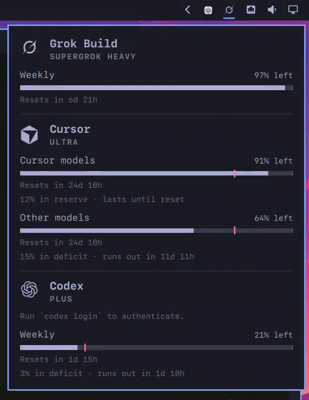

# Omarchy Grok + Cursor usage

Grok SuperGrok and Cursor Ultra remaining usage on the [Omarchy](https://omarchy.org/) bar.

The stock `omarchy.agents` widget already covers Claude, Codex, and Fireworks. This repo adds collectors for **Grok Build (weekly SuperGrok pool)** and **Cursor Ultra (monthly Cursor / Other models)**, tiles every subscription in one popup, and draws **CodexBar-style countdown meters** with an even-burn pace tick.



A 2s open/close clip is in [`docs/demo.mp4`](docs/demo.mp4).

## What you get

- **Menubar** — Grok swirl plus a leftover bar that sits on the same pixels as the panel-open underline.
- **Popup** — Grok and Cursor stacked (no tab switch). Each provider uses a large hero mark.
- **Countdown meters** — fill is remaining, not spent. A vertical tick marks even-burn remaining (elapsed fraction of the window). Caption is reserve / deficit / on pace.
- **Grok** — SuperGrok weekly pool via `cli-chat-proxy.grok.com` and `~/.grok/auth.json` (same session as Grok Build).
- **Cursor** — Ultra monthly `Cursor models` / `Other models` from the local Cursor app JWT and dashboard RPCs.

## Install

On an Omarchy machine, with Grok Build logged in (`grok login`) and the Cursor app signed in:

```bash
git clone https://github.com/songlairui/omarchy-grok-cursor-usage.git
cd omarchy-grok-cursor-usage
./install.sh
omarchy restart shell
```

`install.sh` copies the plugin to `~/.config/omarchy/plugins/$USER.agents`, installs the two collectors plus the inotify watcher, and enables `omarchy-grok-usage.service`.

If the bar still shows the stock `omarchy.agents` widget, swap the id in `~/.config/omarchy/shell.json` to `$USER.agents` and save (the shell hot-reloads).

## How it works

Omarchy's agents panel only **displays** JSON dropped in `~/.local/state/omarchy/agents/usage/`. Packaged `omarchy-agent-usage-update` only scans `$OMARCHY_PATH/bin/`, so Grok and Cursor live as user collectors:

| File | Role |
|---|---|
| `collectors/omarchy-agent-usage-grok` | SuperGrok weekly percent + plan name |
| `collectors/omarchy-agent-usage-cursor` | Ultra monthly Cursor / Other percents |
| `collectors/omarchy-grok-usage-watch` | Refresh on sibling usage writes, or every 15 minutes |
| `plugin/Panel.qml` | Bar leftover + tiled popup + countdown / pace |

No tokens are stored in this repo. Collectors read the logins already on the machine.

## Credits

- **[CodexBar](https://github.com/steipete/CodexBar)** by [Peter Steinberger](https://twitter.com/steipete) ([codexbar.app](https://codexbar.app/)) — remaining-as-countdown meters, even-burn pace tick, and the overall “what do I have left?” language. This plugin is an Omarchy-native take on that idea, not a port of the macOS app.
- **[Omarchy](https://omarchy.org/)** — `omarchy.agents` panel host, bar, and theme tokens. Clone-and-extend via `omarchy plugin clone omarchy.agents`.
- **[Simple Icons](https://simpleicons.org/)** — Cursor cube paths.

## License

MIT. `plugin/Main.qml` and `plugin/Agent.qml` come from Omarchy's agents widget (MIT).
