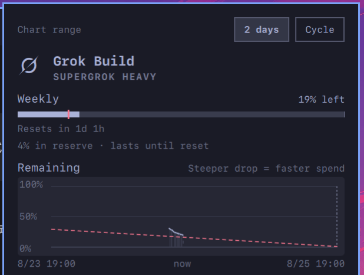
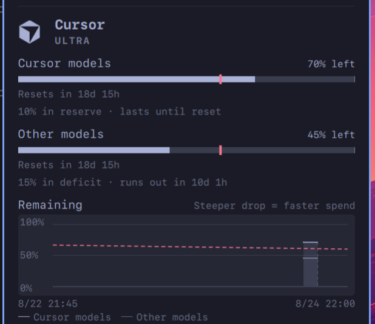
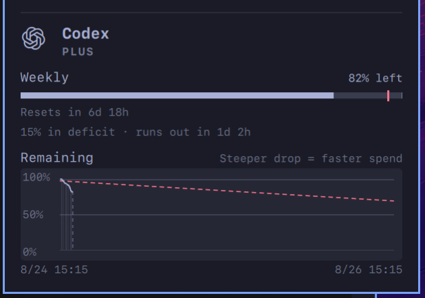

# omarchy-grok-cursor-usage

[Omarchy](https://omarchy.org/) bar widget for leftover AI coding quotas.
One icon, one stacked popup: **Grok**, **Grok Bot**, **Cursor**, and **Codex** (plus any
other collector that drops a usage record).

Stock `omarchy.agents` already covers Claude / Codex / Fireworks as meters
and token tables. This fork adds Grok and Cursor collectors, a patched
Codex collector, leftover-vs-time charts, and CodexBar-style even-burn pace.







## What it does

- **Bar** — Grok mark with a leftover meter on the same pixels as the
  panel-open underline (other styles: vertical meter, percent).
- **Stacked popup** — every ready subscription, no tab switching.
- **Countdown meters** — fill is remaining, not spent. A red tick is
  even-burn remaining (elapsed fraction of the quota window). Caption is
  reserve / deficit / on pace.
- **Remaining over time** — leftover vs time for 7-day (or longer) windows.
  5-hour session pools are ignored. Identical leftover samples collapse to a
  plateau so a 15-minute poll does not pile dots.
  - **2 days** (default): a 2-day span (1.8 days before now, 0.2 after),
    snapped to `:00` / `:15` / `:30` / `:45`. If the current cycle starts
    inside that lookback, the left edge is the quarter-hour at or before the
    first sample and the span stays 2 days. If reset is within 2 days, the
    right edge is the reset and the span stays 2 days. A 7-day cycle cannot
    trip both.
  - **Cycle**: first sample through reset.
  - Data stops at now. A dashed now-marker runs from 0% up to the current
    leftover. A red dashed even-burn line fades toward the future.
- **Plan / auth** — SuperGrok / Ultra / Plus (whatever the collector
  reports). Sign-in hints when a CLI session is missing.

## Install

Needs Omarchy with `omarchy plugin add`, Quickshell, Python 3, Bash, Git,
`jq`, and GNU coreutils (`timeout`), as supplied by Omarchy.

- **Grok** — `grok login` (reads `~/.grok/auth.json`, never stored here)
- **Grok Bot** — signed-in Cursor app (weekly Sand allowance; same session as Cursor)
- **Cursor** — signed-in Cursor app (`~/.config/Cursor/User/globalStorage`)
- **Codex** — `codex login` (app-server RPC; this collector uses
  `-a never` because Codex CLI 0.149 rejected `-a untrusted`)

```bash
omarchy plugin add https://github.com/rafiistcool/omarchy-grok-cursor-usage.git --enable
```

The plugin id is **`rafi.agents`** on every machine; it does not depend on
your login name. Omarchy clones the entire repository, including collectors,
into `~/.config/omarchy/plugins/rafi.agents/`. No separate setup script or
background service is required. The widget refreshes automatically every
15 minutes. Left-click the icon and press `r` to refresh manually.

To keep idle CPU usage low, countdowns and chart geometry pause while the popup
is closed. History files are watched and parsed once, shared by the bar and panel.
Failed quota requests retry after 30 seconds, then back off exponentially up to
the configured refresh interval (at most 15 minutes). Normal collection still
runs every 15 minutes by default; file changes update the display immediately.

Update the widget and its collectors together:

```bash
omarchy plugin update rafi.agents
```

### Migrate an older `install.sh` installation

The old installer created a plain directory, so Omarchy cannot update it.
From a clean checkout of this repository:

```bash
git pull --ff-only
./install.sh --force --apply-layout
omarchy shell shell rescanPlugins
```

This installs a Git checkout with the source repository's origin, backs up
an existing `rafi.agents` directory under
`~/.local/state/omarchy/plugin-backups/`, and backs up `shell.json` before
replacing the old agents bar entry. Usage and history stay in place. If your
old plugin used a different login prefix, its files are retained but its bar
entry is switched to `rafi.agents`.

For a fresh installation, prefer `omarchy plugin add` above. `install.sh`
clones committed source only and refuses an uncommitted working tree.

## Collectors

Omarchy's agents panel only **displays** JSON in
`~/.local/state/omarchy/agents/usage/`. Packaged `omarchy-agent-usage-update`
only scans `$OMARCHY_PATH/bin/`, so this plugin runs its bundled collectors directly:

| File | Role |
|---|---|
| `collectors/omarchy-agent-usage-grok` | SuperGrok weekly percent + plan name |
| `collectors/omarchy-agent-usage-grokbot` | Grok Bot weekly Sand allowance (Cursor session) |
| `collectors/omarchy-agent-usage-cursor` | Ultra monthly Cursor / Other percents |
| `collectors/omarchy-agent-usage-codex` | Codex weekly limit + local session stats |
| `collectors/run-usage-update` | Bundled collectors, user additions, then packaged providers |
| `plugin/history.py` | leftover time series (plateau-merged) |

Bundled collectors take precedence over old copies in
`~/.config/omarchy/agents/`; additional user collectors are still supported.
Disabled providers and targeted retries are respected. Collectors run in
parallel with a 90-second limit, and failed/invalid results leave the last
valid snapshot intact. History is recorded after each update, including
updates run outside the panel.

No access tokens are stored in this repo. Collectors read logins already on
the machine.

Optional: `collectors/omarchy-grok-usage-watch` plus
`systemd/omarchy-grok-usage.service` refresh Grok/Cursor even if the panel
timer is not running. The widget timer is enough for normal use; the unit is
not enabled by `install.sh`. The sample unit uses the default config path;
adjust `ExecStart` if you use a custom `XDG_CONFIG_HOME`.

## Adding an agent

Ship a collector. Do not fork the QML unless you need a new chart id.
Step-by-step and the JSON contract: [docs/adding-an-agent.md](docs/adding-an-agent.md).

Short version: print one JSON object to stdout as
`omarchy-agent-usage-<id>`, install it under `~/.config/omarchy/agents/`,
optional `plugin/assets/<id>.svg`. `percent` is **used** (0..1). Remaining
charts only plot windows about 7 days or longer.

## Data on disk

| Path | What |
|---|---|
| `~/.local/state/omarchy/agents/usage/<id>.json` | latest snapshot (percents, plan, optional token totals) |
| `~/.local/state/omarchy/agents/history/<id>.json` | leftover samples for the chart |
| `~/.config/omarchy/agents/` | optional additional user collectors |
| `~/.config/omarchy/plugins/rafi.agents/` | Git checkout, widget, bundled collectors |

Do not commit usage or history files. They can include spend rates.

## Developing

The repository root contains `manifest.json`; its entry point is
`plugin/Panel.qml`. QML and assets live in `plugin/`, collectors in
`collectors/`. Keep `rafi.agents` consistent in the manifest and panel.

```bash
python3 -m unittest discover -s tests -v
omarchy plugin validate .
# Commit changes, then install locally:
./install.sh --force --apply-layout
omarchy shell shell rescanPlugins
```

The installed checkout and your development checkout are separate. Edit the
development checkout, commit, then reinstall or push and use
`omarchy plugin update rafi.agents`. See [plugin/README.md](plugin/README.md).

## Settings

Top-level keys on the bar entry (`omarchy bar set rafi.agents …`):

| Key | Default | What it does |
|---|---|---|
| `remainingAxis` | `days` | `days` (2-day span) or `cycle` |
| `refreshIntervalSec` | `900` | how often collectors rerun |
| `remainingStyle` | `logo-on-bar` | bar leftover: `logo-on-bar` / `logo-bar` / `bar-percent` / `percent` |

## Credits

- **[CodexBar](https://github.com/steipete/CodexBar)** by
  [Peter Steinberger](https://twitter.com/steipete)
  ([codexbar.app](https://codexbar.app/)) — remaining-as-countdown meters,
  even-burn pace, and the “what do I have left?” language. This is an
  Omarchy-native take, not a port of the macOS app.
- **[Omarchy](https://omarchy.org/)** — `omarchy.agents` host, bar, and
  theme tokens. Clone-and-extend via `omarchy plugin clone omarchy.agents`.
- **[Simple Icons](https://simpleicons.org/)** — Cursor cube paths.

## License

MIT. `plugin/Main.qml` and `plugin/Agent.qml` started from Omarchy's agents
widget (MIT).
