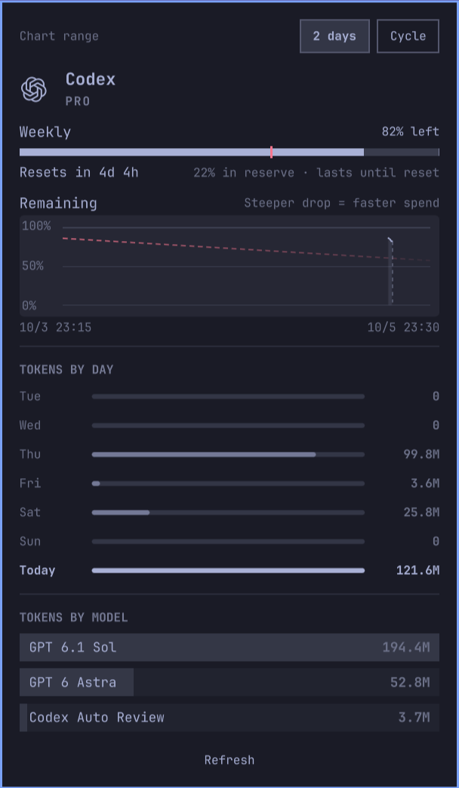

# omarchy-grok-cursor-usage

[Omarchy](https://omarchy.org/) bar widget for remaining AI coding quotas,
daily token counts, and model usage. One icon opens a stacked popup for
**Grok**, **Grok Bot**, **Cursor**, **Codex**, and **Antigravity**, plus packaged
Claude / Fireworks collectors and any additional collector that supplies data.

Stock `omarchy.agents` already covers Claude / Codex / Fireworks as meters
and token tables. This fork adds Grok and Cursor collectors, a patched
Codex collector, Antigravity quotas, remaining-over-time charts, and
CodexBar-style even-burn pace. Token tables appear beneath each provider's
quota chart when that collector supplies token data.



Quota chart examples for Grok and Cursor:


## What it does

- **Bar** — remaining meter aligned with the panel-open underline (other
  styles: vertical meter, percent). Uses Grok's weekly quota when available,
  otherwise the selected provider's available window.
- **Stacked popup** — every enabled provider with quotas, balances, or recorded
  activity, including providers with token data alone. Grok, Grok Bot, and
  Cursor come first, followed by the other providers. Scroll or use the arrow
  keys when the content exceeds the screen height.
- **Countdown meters** — fill is remaining, not spent. A red tick is
  even-burn remaining (elapsed fraction of the quota window). Caption is
  reserve / deficit / on pace.
- **Remaining over time** — leftover vs time for 7-day (or longer) windows.
  5-hour session pools are ignored. Identical leftover samples collapse to a
  plateau so a 15-minute poll does not pile dots.
  - **2 days** (default): a 2-day span (1.8 days before now, 0.2 after),
    snapped to `:00` / `:15` / `:30` / `:45`. If the current cycle starts
    inside that lookback, the left edge is the quarter-hour at or before the
    first sample and the span stays 2 days. If reset is within 2 days, the
    right edge is the reset and the span stays 2 days. A 7-day cycle cannot
    trip both.
  - **Cycle**: first sample through reset.
  - Data stops at now. A dashed now-marker runs from 0% up to the current
    leftover. A red dashed even-burn line fades toward the future.
- **Plan / auth** — SuperGrok / Ultra / Plus (whatever the collector
  reports). Sign-in hints when a CLI session is missing.
- **Token tables** — beneath each provider's quota chart, daily totals for
  the collector's recent seven-day history and the top four models by tokens.
  Today's row is highlighted; hover for prompt/session counts or a model's
  input, output, cache-read, and cache-write breakdown. Model totals cover all
  collector-supplied history, not just the current quota cycle. Tables appear
  only when the collector supplies data; quota-only providers do not show
  token tables.
- **Shared backend** — multiple monitor bars share one collector runner,
  history reader, and set of file watchers. Countdown and chart geometry work
  pauses while the popup is closed; collection continues in the background.
- **Optional sync** — merge token statistics from other machines through a
  synced folder. Subscription quotas and prepaid balances stay local.

## Provider data

| Provider | Quotas / balance | Token and model tables |
|---|---|---|
| Grok | SuperGrok weekly pool and plan | Not collected |
| Grok Bot | Weekly Sand allowance through the Cursor session | Not collected |
| Cursor | Monthly Cursor-model and other-model pools | Not collected |
| Codex | Rate-limit windows and plan through app-server RPC | Local Codex, pi/omp, and OpenCode history |
| Antigravity | Gemini and third-party model windows from the running app | Not collected |
| Claude | Packaged Omarchy collector | Whatever the packaged collector supplies |
| Fireworks | Packaged Omarchy collector, including estimated balance | Whatever the packaged collector supplies |

Codex reads native `sessions` and `archived_sessions` under `CODEX_HOME`
(default `~/.codex`), pi/omp sessions using `openai-codex`, and OpenCode's
OpenAI-provider messages. Native Codex files are scanned when modified within
the last 30 days; their older recorded turns are included too. Model totals
therefore describe the history scanned by the collector, not a guaranteed
lifetime account total or the currently selected model. Daily totals use the
local calendar date and include uncached input, output, and cached input once.

## Install

Needs Omarchy with `omarchy plugin add`, Quickshell, Python 3, Bash, Git,
`jq`, `rg` (for pi/omp token history), and GNU coreutils (`timeout`), as
supplied by Omarchy.

- **Grok** — `grok login` (reads `~/.grok/auth.json`, never stored here)
- **Grok Bot** — signed-in Cursor app (weekly Sand allowance; same session as Cursor)
- **Cursor** — signed-in Cursor app (`~/.config/Cursor/User/globalStorage`)
- **Codex** — `codex login` for account quotas; local token history can still
  appear when account limits are unavailable. The collector starts app-server
  with a read-only sandbox and approvals disabled.
- **Antigravity** — start the signed-in app or run `agy` so its local language
  server is available.
- **Claude / Fireworks** — use the authentication and configuration supported
  by your packaged Omarchy collectors.

```bash
omarchy plugin add https://github.com/rafiistcool/omarchy-grok-cursor-usage.git --enable
```

The plugin id is **`rafi.agents`** on every machine; it does not depend on
your login name. Omarchy clones the entire repository, including collectors,
into `~/.config/omarchy/plugins/rafi.agents/`. No separate setup script or
background service is required. The widget refreshes automatically every
15 minutes. Left-click the icon to open the popup. Press `r` or Enter to force
a refresh; the Refresh button has a one-minute cooldown after an update.
Right-click the bar icon to open Omarchy's agent picker.

To keep idle CPU usage low, countdowns and chart geometry pause while the popup
is closed. History files are watched and parsed once, shared by the bar and panel.
Failed quota requests retry after 30 seconds, then back off exponentially up to
the configured refresh interval (at most 15 minutes). Normal collection still
runs every 15 minutes by default; file changes update the display immediately.

Update the widget and its collectors together:

```bash
omarchy plugin update rafi.agents
```

For a non-interactive update, add `--yes`. If the popup still shows an older
layout after updating, reload the plugin catalog and, if needed, restart the
shell to clear cached QML:

```bash
omarchy shell shell rescanPlugins
omarchy restart shell
```

### Migrate an older `install.sh` installation

The old installer created a plain directory, so Omarchy cannot update it.
From a clean checkout of this repository:

```bash
git pull --ff-only
./install.sh --force --apply-layout
omarchy shell shell rescanPlugins
```

This installs a Git checkout with the source repository's origin, backs up
an existing `rafi.agents` directory under
`~/.local/state/omarchy/plugin-backups/`, and backs up `shell.json` before
replacing the old agents bar entry. Usage and history stay in place. If your
old plugin used a different login prefix, its files are retained but its bar
entry is switched to `rafi.agents`.

For a fresh installation, prefer `omarchy plugin add` above. `install.sh`
clones committed source only and refuses an uncommitted working tree.

## Collectors

Omarchy's agents panel only **displays** JSON in
`~/.local/state/omarchy/agents/usage/`. Packaged `omarchy-agent-usage-update`
only scans `$OMARCHY_PATH/bin/`, so this plugin runs its bundled collectors directly:

| File | Role |
|---|---|
| `collectors/omarchy-agent-usage-grok` | SuperGrok weekly percent + plan name |
| `collectors/omarchy-agent-usage-grokbot` | Grok Bot weekly Sand allowance (Cursor session) |
| `collectors/omarchy-agent-usage-cursor` | Ultra monthly Cursor / Other percents |
| `collectors/omarchy-agent-usage-codex` | Codex rate-limit windows + local token/model statistics |
| `collectors/omarchy-agent-usage-antigravity` | Running Antigravity app's plan and model quota windows |
| `collectors/run-usage-update` | Bundled collectors, user additions, then packaged providers |
| `plugin/history.py` | leftover time series (plateau-merged) |

Bundled collectors take precedence over old copies in
`~/.config/omarchy/agents/`; additional user collectors are still supported.
Disabled providers and targeted retries are respected. Collectors run in
parallel with a 90-second limit, and failed/invalid results leave the last
valid snapshot intact. History is recorded after each update, including
updates run outside the panel.

Normal Codex updates can reuse a local scan for 20 seconds to deduplicate
concurrent requests. `--limits-only` can reuse it for up to 15 minutes;
`--force` rescans local history. Quota collectors also keep short-lived caches
and can retain known limits when a request fails. A collector can request an
early retry with `retryAdvised: true`; the widget backs off from 30 seconds
to the configured refresh interval, capped at 15 minutes.

No access tokens are stored in this repo. Collectors read logins already on
the machine.

Optional: `collectors/omarchy-grok-usage-watch` plus
`systemd/omarchy-grok-usage.service` refresh Grok/Cursor even if the panel
timer is not running. The widget timer is enough for normal use; the unit is
not enabled by `install.sh`. The sample unit uses the default config path;
adjust `ExecStart` if you use a custom `XDG_CONFIG_HOME`.

The optional watcher targets only Grok and Cursor, independently of the bar's
provider settings. Its interval defaults to 900 seconds and can be set through
`OMARCHY_GROK_USAGE_INTERVAL`; `inotifywait` is optional for change-triggered
refreshes. Grok Bot and the other providers still use the widget's runner.

## Adding an agent

Ship a collector. Do not fork the QML unless you need a new chart id.
Step-by-step and the JSON contract: [docs/adding-an-agent.md](docs/adding-an-agent.md).

Short version: print one JSON object to stdout as
`omarchy-agent-usage-<id>`, install it under `~/.config/omarchy/agents/`,
optional `plugin/assets/<id>.svg`. `percent` is **used** (0..1). Remaining
charts only plot windows about 7 days or longer.

## Data on disk

| Path | What |
|---|---|
| `~/.local/state/omarchy/agents/usage/<id>.json` | latest snapshot (percents, plan, optional token totals) |
| `~/.local/state/omarchy/agents/history/<id>.json` | leftover samples for the chart |
| `~/.config/omarchy/agents/` | optional additional user collectors |
| `~/.config/omarchy/plugins/rafi.agents/` | Git checkout, widget, bundled collectors |
| `~/.cache/omarchy/agent-usage/` | Collector quota caches and Codex scan cache / lock |
| `~/.local/state/omarchy/plugin-backups/` | Previous checkouts saved by `install.sh --force` |

The collectors and backend honor `XDG_CONFIG_HOME`, `XDG_STATE_HOME`,
`XDG_CACHE_HOME`, and `XDG_DATA_HOME` where applicable. Grok also accepts
`GROK_HOME`; Codex accepts `CODEX_HOME`.

Do not commit usage or history files. They can include spend rates.

## Developing

The repository root contains `manifest.json`; its entry point is
`plugin/Panel.qml`. QML and assets live in `plugin/`, collectors in
`collectors/`. Keep `rafi.agents` consistent in the manifest and panel.

```bash
python3 -m unittest discover -s tests -v
omarchy plugin validate .
# Commit changes, then install locally:
./install.sh --force
omarchy shell shell rescanPlugins
```

Use `--apply-layout` only when switching an older bar entry to `rafi.agents`.
If the layout remains stale after the rescan, run `omarchy restart shell`.

Collector tests run in temporary directories. Installation tests require
the Omarchy CLI; shared-backend tests require Quickshell; panel tests also
require an active Wayland session. The panel test uses an isolated backend
and fake collectors, checks provider-specific tooltips and model totals, and
lays out overflow content without opening a desktop overlay. Tests with
missing runtime requirements are skipped.

The installed checkout and your development checkout are separate. Edit the
development checkout, commit, then reinstall or push and use
`omarchy plugin update rafi.agents`. See [plugin/README.md](plugin/README.md).

## Settings

Top-level keys on the bar entry (`omarchy bar set rafi.agents …`):

| Key | Default | What it does |
|---|---|---|
| `remainingAxis` | `days` | `days` (2-day span) or `cycle` |
| `refreshIntervalSec` | `900` | how often collectors rerun |
| `remainingStyle` | `logo-on-bar` | bar leftover: `logo-on-bar` / `logo-bar` / `bar-percent` / `percent` |
| `remainingShowPercent` | `Off` | show a percentage beside the mark or meter |
| `remainingLogoSize` | `13` | logo sizing setting |
| `remainingBarWidth` | `13` | meter width |
| `remainingBarHeight` | `3` | meter height |
| `remainingFontSize` | `10` | percentage font size |
| `providers` | all bundled / stock ids enabled | per-provider `{ "enabled": false }` hides and stops polling that provider |
| `syncMode` | `Off` | `On` enables token-statistic aggregation when a folder is configured |
| `syncDir` | empty | folder managed by Syncthing, Dropbox, rsync, or another sync tool |
| `syncFileName` | empty | defaults to `<device-id>.json`; use a unique filename on each machine |
| `syncDeviceId` | empty | device name; falls back to the snapshot filename / detected hostname |

Settings are stored on the `rafi.agents` entry in `shell.json`; they are
also described in the plugin manifest. For example:

```bash
omarchy bar set rafi.agents remainingAxis cycle
omarchy bar set rafi.agents refreshIntervalSec 300
```

### Sync token statistics

Configure a dedicated shared folder on each machine and give each machine
a distinct identity before enabling sync:

```bash
omarchy bar set rafi.agents syncDir "$HOME/Sync/agent-usage"
omarchy bar set rafi.agents syncDeviceId desktop
omarchy bar set rafi.agents syncMode On
```

The backend writes a snapshot for this machine and merges the folder's JSON
snapshots. Machine-local token counts add together; `scope: "account"`
statistics use the highest value per field to avoid counting an account
total once per machine. Active dates are combined as a union. Quota windows,
balances, and remaining charts stay local. Snapshot files contain usage
statistics, not login credentials. The plugin does not synchronize the
folder itself.

### Troubleshooting

- **Missing token tables:** Grok, Grok Bot, Cursor, and Antigravity currently
  collect quotas only. Codex needs local token-bearing history; packaged
  providers depend on the data their collectors return.
- **Old totals:** press `r` to force a full update. Token counts reflect the
  latest collector snapshot and do not stream live during a model response.
- **Old layout after updating:** rescan plugins, then restart the shell if
  necessary. Keep the installed checkout clean so native updates can
  fast-forward it.
- **Missing provider:** enable it in `providers`, authenticate or start its
  app, then refresh. An enabled provider without usable data stays hidden.

## Credits

- **[CodexBar](https://github.com/steipete/CodexBar)** by
  [Peter Steinberger](https://twitter.com/steipete)
  ([codexbar.app](https://codexbar.app/)) — remaining-as-countdown meters,
  even-burn pace, and the “what do I have left?” language. This is an
  Omarchy-native take, not a port of the macOS app.
- **[Omarchy](https://omarchy.org/)** — `omarchy.agents` host, bar, and
  theme tokens. Clone-and-extend via `omarchy plugin clone omarchy.agents`.
- **[Simple Icons](https://simpleicons.org/)** — Cursor cube paths.

## License

MIT. `plugin/Main.qml` and `plugin/Agent.qml` started from Omarchy's agents
widget (MIT).
